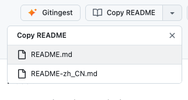

# GitHub to Gitingest + Copy README

  
  
  

A Tampermonkey/Greasemonkey userscript that adds two native GitHub buttons to **repository** pages:

- **Gitingest** — opens the repo on [gitingest.com](https://gitingest.com), which converts GitHub repositories into LLM-friendly text digests, perfect for feeding codebases to AI assistants.
- **Copy README** — copies the repository's README as raw Markdown to your clipboard. When a repo has several READMEs (localized variants, etc.), it becomes a split button with a dropdown to pick which one.

  

  

## Features

- Built from GitHub's own [Primer](https://primer.style/) components (`btn`, `BtnGroup`, `SelectMenu`), so the buttons are pixel-native — matching the active theme (light / dark / dimmed) and sitting seamlessly beside Fork / Star.
- **Copy README** fetches the raw file from `raw.githubusercontent.com` (a CDN with no API rate limit) — it uses the exact README link on the page when available, then falls back to common filenames at the `HEAD` ref, so it resolves the right file regardless of name, casing, or default branch (`main`/`master`) and copies raw Markdown, not rendered HTML. Shows inline **Copied** / **No README** / **Failed** feedback.
- **Multiple READMEs** — when the page lists more than one root-level README, the button turns into a native split button; the dropdown lets you copy any of them, with the unqualified / English Markdown copied by default.
- Runs on repository pages only — user/org profiles and GitHub app routes (settings, notifications, explore, …) are excluded.
- Handles GitHub's SPA (Turbo/PJAX) navigation — the buttons persist and re-insert across page changes.

## Installation

1. Install a userscript manager — [Tampermonkey](https://www.tampermonkey.net/) or [Violentmonkey](https://violentmonkey.github.io/) (Chrome/Edge/Firefox/Safari).
2. Click the install button:

   

3. Confirm **Install** in the manager's dialog. Updates are delivered automatically from this repo.

## How it works

1. Resolves the current page to an `{owner, repo}` pair, bailing on non-repo routes.
2. Injects Primer-tokenized styles and finds the best anchor point (classic `pagehead-actions`, the React repo-title header, or the code-view breadcrumb).
3. **Gitingest** links to `gitingest.com/{owner}/{repo}`.
4. **Copy README** discovers the root-level READMEs listed on the page. One README copies straight from `raw.githubusercontent.com`; several turn the button into a split button whose dropdown copies whichever you pick. On pages without a file list, it falls back to probing common filenames at the `HEAD` ref.

## Credits

Based on the original script by [Doiiars](https://greasyfork.org/en/scripts/527278).

## License

MIT
