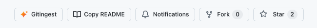

# GitHub to Gitingest + Copy README

  
  
  

A Tampermonkey/Greasemonkey userscript that adds two native-styled buttons to GitHub **repository** pages:

- **Gitingest** — opens the repo on [gitingest.com](https://gitingest.com), which converts GitHub repositories into LLM-friendly text digests, perfect for feeding codebases to AI assistants.
- **Copy README** — copies the repository's README as raw Markdown to your clipboard.

  

## Features

- Two buttons styled with GitHub's own [Primer](https://primer.style/) design tokens, so they match the active theme (light / dark / dimmed) and sit natively beside Watch / Fork / Star.
- **Copy README** resolves the README via GitHub's REST API (`/repos/{owner}/{repo}/readme`), so it finds the file no matter its name, casing, folder, or default branch — and copies raw Markdown, not rendered HTML. Shows inline **Copied** / **No README** / **Failed** feedback.
- Runs on repository pages only — user/org profiles and GitHub app routes (settings, notifications, explore, …) are excluded.
- Handles GitHub's SPA (Turbo/PJAX) navigation — the buttons persist and re-insert across page changes.

## Installation

1. Install a userscript manager — [Tampermonkey](https://www.tampermonkey.net/) or [Violentmonkey](https://violentmonkey.github.io/) (Chrome/Edge/Firefox/Safari).
2. Click the install button:

   

3. Confirm **Install** in the manager's dialog. Updates are delivered automatically from this repo.

## How it works

1. Resolves the current page to an `{owner, repo}` pair, bailing on non-repo routes.
2. Injects Primer-tokenized styles and finds the best anchor point (classic `pagehead-actions`, the React repo-title header, or the code-view breadcrumb).
3. **Gitingest** links to `gitingest.com/{owner}/{repo}`.
4. **Copy README** fetches raw Markdown from the GitHub API and writes it to the clipboard.

> **Note:** the unauthenticated GitHub API allows 60 requests/hour per IP; a very heavy day of copying could briefly hit that limit (surfaced as **Failed**).

## Credits

Based on the original script by [Doiiars](https://greasyfork.org/en/scripts/527278).

## License

MIT
